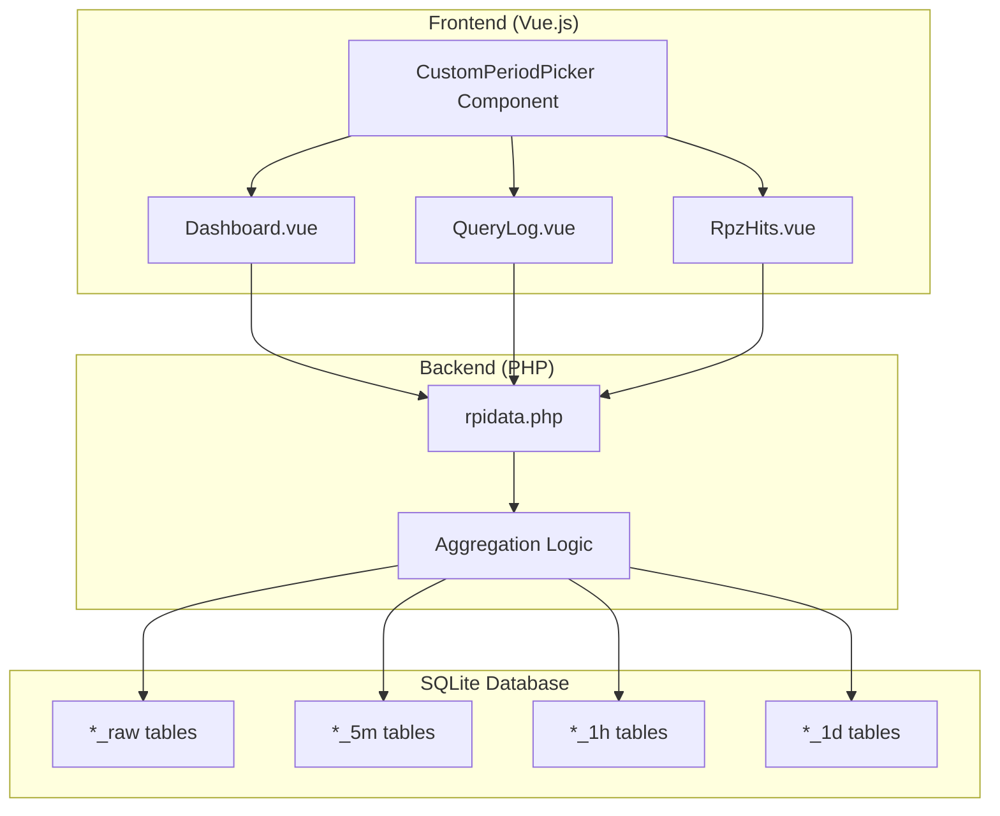

# Design Document: Custom Period Feature

## Overview

This design document describes the implementation of custom period functionality for the RpiDNS application. The feature enables users to select arbitrary date/time ranges for viewing Dashboard statistics, Query Logs, and RPZ Hits data, replacing the current disabled "custom" button with a fully functional date range picker.

The implementation follows the existing architecture patterns, extending the current period-based filtering system to support custom start and end timestamps while automatically selecting the appropriate data aggregation level based on the requested time span.

## Architecture

### High-Level Architecture



### Data Flow

1. User clicks "custom" button → CustomPeriodPicker modal opens
2. User selects start/end date/time → Validation occurs
3. User clicks "Apply" → Component emits period change event
4. Parent component updates period state and triggers API call
5. Backend receives start_dt/end_dt parameters
6. Backend determines optimal aggregation level based on duration
7. Backend queries appropriate tables and returns data
8. Frontend displays results

## Components and Interfaces

### Frontend Components

#### CustomPeriodPicker.vue (New Component)

A reusable modal component for selecting custom date/time ranges.

```javascript
// Props
{
  show: Boolean,           // Controls modal visibility
  initialStart: Date,      // Initial start date/time
  initialEnd: Date         // Initial end date/time
}

// Emits
{
  'update:show': Boolean,  // Modal visibility change
  'apply': {               // Period selection confirmed
    start_dt: Number,      // Unix timestamp (seconds)
    end_dt: Number         // Unix timestamp (seconds)
  },
  'cancel': void           // Selection cancelled
}

// Internal State
{
  startDate: Date,
  startTime: String,       // HH:mm format
  endDate: Date,
  endTime: String,         // HH:mm format
  validationError: String
}
```

#### Dashboard.vue (Modified)

Changes to support custom period:

```javascript
// New reactive state
const customPeriodStart = ref(null)  // Unix timestamp
const customPeriodEnd = ref(null)    // Unix timestamp
const showCustomPicker = ref(false)

// Modified period_options - enable custom
const period_options = [
  { text: '30m', value: '30m' },
  { text: '1h', value: '1h' },
  { text: '1d', value: '1d' },
  { text: '1w', value: '1w' },
  { text: '30d', value: '30d' },
  { text: 'custom', value: 'custom', disabled: false }  // Now enabled
]

// Modified API calls to include custom period params
const fetchTableData = async (endpoint, loadingKey, dataRef) => {
  let url = `/rpi_admin/rpidata.php?req=${endpoint}&period=${dash_period.value}`
  if (dash_period.value === 'custom') {
    url += `&start_dt=${customPeriodStart.value}&end_dt=${customPeriodEnd.value}`
  }
  // ... rest of fetch logic
}
```

#### QueryLog.vue (Modified)

Changes to support custom period:

```javascript
// New reactive state
const customPeriodStart = ref(null)
const customPeriodEnd = ref(null)
const showCustomPicker = ref(false)

// New props to receive custom period from parent
props: {
  customStart: { type: Number, default: null },
  customEnd: { type: Number, default: null }
}

// Modified apiUrl computed property
const apiUrl = computed(() => {
  let url = '/rpi_admin/rpidata.php?req=queries_raw' +
    '&period=' + localPeriod.value
  if (localPeriod.value === 'custom') {
    url += '&start_dt=' + customPeriodStart.value + '&end_dt=' + customPeriodEnd.value
  }
  // ... rest of URL params
  return url
})
```

#### RpzHits.vue (Modified)

Similar changes as QueryLog.vue for custom period support.

### Backend API

#### rpidata.php (Modified)

New parameters accepted:
- `start_dt`: Unix timestamp for period start (required when period=custom)
- `end_dt`: Unix timestamp for period end (required when period=custom)

#### Aggregation Level Selection Logic

```php
// Determine aggregation level based on custom period duration
function getAggregationConfig($start_dt, $end_dt) {
    $duration = $end_dt - $start_dt;
    
    if ($duration <= 3600) {
        // <= 1 hour: use raw data only
        return ['table' => '_raw', 'use_aggregated' => false];
    } else if ($duration <= 86400) {
        // <= 1 day: use 5m + raw for recent data
        return ['table' => '_5m', 'use_aggregated' => true, 'granularity' => '5m'];
    } else if ($duration <= 604800) {
        // <= 7 days: use 1h + 5m + raw
        return ['table' => '_1h', 'use_aggregated' => true, 'granularity' => '1h'];
    } else {
        // > 7 days: use 1d + 1h + 5m + raw
        return ['table' => '_1d', 'use_aggregated' => true, 'granularity' => '1d'];
    }
}
```

## Data Models

### Custom Period State

```typescript
interface CustomPeriodState {
  isCustom: boolean;
  startTimestamp: number | null;  // Unix timestamp in seconds
  endTimestamp: number | null;    // Unix timestamp in seconds
}

interface PeriodParams {
  period: '30m' | '1h' | '1d' | '1w' | '30d' | 'custom';
  start_dt?: number;  // Required when period === 'custom'
  end_dt?: number;    // Required when period === 'custom'
}
```

### API Request/Response

```typescript
// Request parameters for custom period
interface CustomPeriodRequest {
  req: string;
  period: 'custom';
  start_dt: number;   // Unix timestamp
  end_dt: number;     // Unix timestamp
  // ... other existing params
}

// Response format remains unchanged
interface ApiResponse {
  status: 'ok' | 'error';
  records?: string;
  data?: any[];
  reason?: string;
}
```


## Correctness Properties

*A property is a characteristic or behavior that should hold true across all valid executions of a system—essentially, a formal statement about what the system should do. Properties serve as the bridge between human-readable specifications and machine-verifiable correctness guarantees.*

### Property 1: Date Validation Correctness

*For any* start date/time and end date/time pair, the Custom_Period_Selector SHALL report a validation error if and only if start >= end.

**Validates: Requirements 1.4, 1.5**

### Property 2: Custom Period Apply Emits Correct Data

*For any* valid date range (where start < end), when the Apply button is clicked, the Custom_Period_Selector SHALL emit an event containing the exact start and end timestamps as Unix timestamps in seconds.

**Validates: Requirements 1.7**

### Property 3: Frontend API Calls Include Custom Period Parameters

*For any* custom period selection on Dashboard, Query_Log, or RPZ_Hits, all API calls SHALL include start_dt and end_dt parameters matching the selected timestamps.

**Validates: Requirements 2.1, 2.2, 2.3, 3.1, 3.2, 3.3, 4.1, 4.2, 4.3**

### Property 4: Backend Date Range Filtering

*For any* API request with start_dt and end_dt parameters, all returned records SHALL have timestamps within the inclusive range [start_dt, end_dt].

**Validates: Requirements 5.1, 5.2, 5.3, 5.4, 5.5, 5.6**

### Property 5: Aggregation Level Selection

*For any* custom period with duration D:
- If D <= 3600 (1 hour), raw tables SHALL be used
- If 3600 < D <= 86400 (1 day), 5-minute aggregated tables SHALL be used
- If 86400 < D <= 604800 (7 days), 1-hour aggregated tables SHALL be used
- If D > 604800, 1-day aggregated tables SHALL be used

**Validates: Requirements 6.1, 6.2, 6.3, 6.4**

### Property 6: View Mode Preservation

*For any* custom period selection, switching between "logs" and "stats" view modes SHALL NOT change the start_dt or end_dt values.

**Validates: Requirements 3.4, 4.4**

### Property 7: Navigation Period Persistence

*For any* custom period selection on Dashboard, navigating to Query_Log or RPZ_Hits via click actions SHALL pass the same start_dt and end_dt values to the target component.

**Validates: Requirements 2.4, 7.1, 7.2, 7.3**

## Error Handling

### Frontend Error Handling

| Error Condition | Handling Strategy |
|----------------|-------------------|
| Start date >= End date | Display validation error message, disable Apply button |
| Empty start or end date | Display "Please select both dates" message |
| API request fails | Display error toast, keep previous data visible |
| Invalid date format | Reset to current date, show format hint |

### Backend Error Handling

| Error Condition | Handling Strategy |
|----------------|-------------------|
| Missing start_dt when period=custom | Return error response with reason |
| Missing end_dt when period=custom | Return error response with reason |
| Invalid timestamp format | Return error response with reason |
| start_dt > end_dt | Return error response with reason |
| Database query fails | Return error response with database error |

### Error Response Format

```json
{
  "status": "error",
  "reason": "start_dt must be less than end_dt"
}
```

## Testing Strategy

### Unit Tests

Unit tests will verify specific examples and edge cases:

1. **CustomPeriodPicker Component Tests**
   - Renders date/time inputs correctly
   - Apply button is disabled when dates are invalid
   - Emits correct event format on apply
   - Validation error displays for invalid ranges

2. **Dashboard Custom Period Tests**
   - Custom button opens picker modal
   - API URLs include custom period params
   - Navigation passes custom period to child tabs

3. **QueryLog/RpzHits Custom Period Tests**
   - API URLs include custom period params in both modes
   - Mode switch preserves custom period
   - Timestamp column visible in logs mode

4. **Backend API Tests**
   - Returns error for missing start_dt/end_dt
   - Returns error for invalid date range
   - Returns filtered data for valid custom period

### Property-Based Tests

Property-based tests will use **Vitest** with **fast-check** library for the frontend and **PHPUnit** for the backend.

Each property test will run a minimum of 100 iterations with randomly generated inputs.

1. **Property 1 Test**: Generate random date pairs, verify validation result matches (start >= end)
2. **Property 2 Test**: Generate valid date ranges, verify emitted timestamps match input
3. **Property 3 Test**: Generate custom periods, verify all API calls include correct params
4. **Property 4 Test**: Generate date ranges and mock data, verify all returned records are within range
5. **Property 5 Test**: Generate durations, verify correct aggregation level is selected
6. **Property 6 Test**: Generate custom periods, switch modes, verify period unchanged
7. **Property 7 Test**: Generate custom periods, simulate navigation, verify period passed correctly

### Test Configuration

```javascript
// vitest.config.js additions for property tests
export default {
  test: {
    // ... existing config
    testTimeout: 30000,  // Allow time for 100+ iterations
  }
}
```

### Test File Structure

```
rpidns-frontend/src/__tests__/
├── CustomPeriodPicker.test.js      # Unit + Property tests for picker
├── Dashboard.custom-period.test.js  # Custom period integration tests
├── QueryLog.custom-period.test.js   # Custom period integration tests
├── RpzHits.custom-period.test.js    # Custom period integration tests
└── custom-period.property.test.js   # Property-based tests
```
