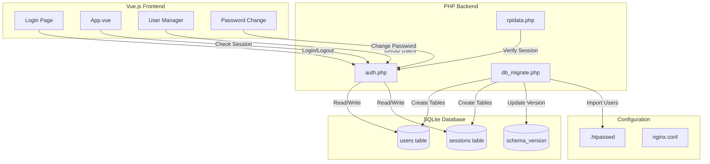
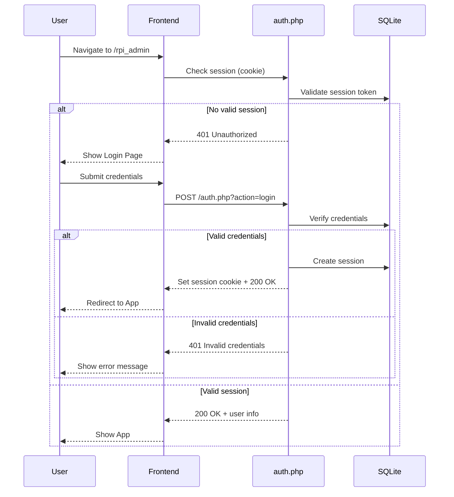

# Design Document: User Authentication System

## Overview

This design document describes the architecture and implementation approach for replacing nginx's built-in basic authentication with a custom authentication system for RpiDNS. The solution consists of:

1. A PHP backend authentication service integrated with the existing SQLite database
2. A Vue.js login page component matching the existing UI style
3. Session management using secure HTTP-only cookies
4. User management interface for administrators
5. Database schema migrations for incremental upgrades

The design prioritizes security (bcrypt hashing, secure tokens, rate limiting), maintainability (integration with existing codebase patterns), and user experience (responsive design, inline error handling).

## Architecture



### Authentication Flow



## Components and Interfaces

### Backend Components

#### 1. auth.php - Authentication Service

Main authentication endpoint handling all auth-related operations.

```php
<?php
// Pseudocode for auth.php structure

class AuthService {
    private $db;
    private $rateLimiter;
    
    // Login: Validate credentials, create session
    public function login(string $username, string $password): array
    
    // Logout: Invalidate session
    public function logout(string $sessionToken): bool
    
    // Verify: Check if session is valid
    public function verifySession(string $sessionToken): ?array
    
    // Change password for current user
    public function changePassword(string $currentPassword, string $newPassword): bool
    
    // Admin: List all users
    public function listUsers(): array
    
    // Admin: Create new user
    public function createUser(string $username, string $password, bool $isAdmin): bool
    
    // Admin: Delete user
    public function deleteUser(int $userId): bool
    
    // Admin: Reset user password
    public function resetPassword(int $userId): string
    
    // Rate limiting check
    private function checkRateLimit(string $ip): bool
}
```

**API Endpoints:**

| Method | Endpoint | Action | Auth Required |
|--------|----------|--------|---------------|
| POST | `/auth.php?action=login` | Authenticate user | No |
| POST | `/auth.php?action=logout` | End session | Yes |
| GET | `/auth.php?action=verify` | Check session validity | No |
| POST | `/auth.php?action=change_password` | Update password | Yes |
| GET | `/auth.php?action=users` | List all users | Yes (Admin) |
| POST | `/auth.php?action=create_user` | Create new user | Yes (Admin) |
| DELETE | `/auth.php?action=delete_user` | Remove user | Yes (Admin) |
| POST | `/auth.php?action=reset_password` | Reset user password | Yes (Admin) |

#### 2. db_migrate.php - Database Migration Service

Handles schema versioning and incremental database upgrades. This generic migration service can be extended for future schema changes beyond authentication.

```php
<?php
// Pseudocode for migration service

class DbMigration {
    private $db;
    private $currentVersion;
    private $targetVersion = 2; // Increment from DBVersion=1
    
    // Check and run pending migrations
    public function migrate(): bool
    
    // Get list of available migrations
    private function getMigrations(): array
    
    // Migration v1 -> v2: Add auth tables
    private function migrateV1ToV2(): bool
    
    // Import users from .htpasswd file (for v1->v2 migration)
    private function importHtpasswdUsers(string $htpasswdPath): int
    
    // Get current schema version
    public function getSchemaVersion(): int
    
    // Update schema version
    private function setSchemaVersion(int $version): bool
    
    // Rollback on failure
    private function rollback(): bool
}
```

### Frontend Components

#### 1. LoginPage.vue - Login Interface

```vue
<!-- Pseudocode structure -->
<template>
  <div class="login-container">
    <form @submit.prevent="handleLogin">
      <input v-model="username" type="text" placeholder="Username" />
      <input v-model="password" type="password" placeholder="Password" />
      <button type="submit" :disabled="loading">Sign In</button>
      <div v-if="error" class="error">{{ error }}</div>
    </form>
  </div>
</template>

<script>
export default {
  data() {
    return {
      username: '',
      password: '',
      error: '',
      loading: false
    }
  },
  methods: {
    async handleLogin() { /* POST to auth.php */ },
    async checkSession() { /* GET auth.php?action=verify */ }
  }
}
</script>
```

#### 2. UserManager.vue - Admin User Management

```vue
<!-- Pseudocode structure -->
<template>
  <div class="user-manager">
    <BTable :items="users" :fields="fields">
      <template #cell(actions)="data">
        <BButton @click="resetPassword(data.item)">Reset Password</BButton>
        <BButton @click="deleteUser(data.item)" variant="danger">Delete</BButton>
      </template>
    </BTable>
    <BButton @click="showCreateModal">Add User</BButton>
  </div>
</template>
```

#### 3. PasswordChange.vue - Password Change Form

```vue
<!-- Pseudocode structure -->
<template>
  <BModal v-model="visible" title="Change Password">
    <BForm @submit.prevent="handleSubmit">
      <BFormInput v-model="currentPassword" type="password" label="Current Password" />
      <BFormInput v-model="newPassword" type="password" label="New Password" />
      <BFormInput v-model="confirmPassword" type="password" label="Confirm Password" />
    </BForm>
  </BModal>
</template>
```

### Nginx Configuration Changes

Remove basic auth and add session verification:

```nginx
# Before: Basic auth
location ^~ /rpi_admin {
    auth_basic "RpiDNS Admin";
    auth_basic_user_file /opt/rpidns/conf/.htpasswd;
    # ...
}

# After: PHP session verification (handled in PHP)
location ^~ /rpi_admin {
    # No auth_basic - handled by PHP session
    # ...
}
```

## Data Models

### Users Table

```sql
CREATE TABLE IF NOT EXISTS users (
    id INTEGER PRIMARY KEY AUTOINCREMENT,
    username TEXT NOT NULL UNIQUE,
    password_hash TEXT NOT NULL,
    is_admin INTEGER NOT NULL DEFAULT 0,
    created_at INTEGER NOT NULL,
    updated_at INTEGER NOT NULL
);

CREATE INDEX idx_users_username ON users(username);
```

### Sessions Table

```sql
CREATE TABLE IF NOT EXISTS sessions (
    id INTEGER PRIMARY KEY AUTOINCREMENT,
    user_id INTEGER NOT NULL,
    token TEXT NOT NULL UNIQUE,
    created_at INTEGER NOT NULL,
    expires_at INTEGER NOT NULL,
    ip_address TEXT,
    user_agent TEXT,
    FOREIGN KEY (user_id) REFERENCES users(id) ON DELETE CASCADE
);

CREATE INDEX idx_sessions_token ON sessions(token);
CREATE INDEX idx_sessions_user_id ON sessions(user_id);
CREATE INDEX idx_sessions_expires ON sessions(expires_at);
```

### Login Attempts Table (Rate Limiting)

```sql
CREATE TABLE IF NOT EXISTS login_attempts (
    id INTEGER PRIMARY KEY AUTOINCREMENT,
    ip_address TEXT NOT NULL,
    attempted_at INTEGER NOT NULL,
    success INTEGER NOT NULL DEFAULT 0
);

CREATE INDEX idx_login_attempts_ip ON login_attempts(ip_address);
CREATE INDEX idx_login_attempts_time ON login_attempts(attempted_at);
```

### Schema Version Table

```sql
CREATE TABLE IF NOT EXISTS schema_version (
    version INTEGER NOT NULL,
    applied_at INTEGER NOT NULL
);
```


## Correctness Properties

*A property is a characteristic or behavior that should hold true across all valid executions of a system—essentially, a formal statement about what the system should do. Properties serve as the bridge between human-readable specifications and machine-verifiable correctness guarantees.*

### Property 1: Invalid Session Redirects to Login

*For any* request to a protected resource with an invalid, missing, or expired session token, the Authentication_System should return a 401 status or redirect to the login page.

**Validates: Requirements 1.1, 1.5**

### Property 2: Valid Credentials Create Session

*For any* valid username and password combination in the database, submitting these credentials to the login endpoint should result in a new session being created and a session token being returned.

**Validates: Requirements 1.2**

### Property 3: Error Message Uniformity

*For any* invalid login attempt (wrong username, wrong password, or both), the Authentication_System should return the same generic error message without revealing which field was incorrect.

**Validates: Requirements 1.3**

### Property 4: Valid Session Grants Access

*For any* valid, non-expired session token, requests to protected resources should be allowed and return the requested data.

**Validates: Requirements 1.4**

### Property 5: Logout Invalidates Session

*For any* valid session, calling the logout endpoint should remove the session from the database, and subsequent requests with that token should be rejected.

**Validates: Requirements 2.1**

### Property 6: Password Change Requires Current Password

*For any* password change request, if the current password field is missing or incorrect, the request should be rejected with an error.

**Validates: Requirements 3.1, 3.3**

### Property 7: Password Change Round-Trip

*For any* successful password change operation, authenticating with the new password should succeed, and authenticating with the old password should fail.

**Validates: Requirements 3.2**

### Property 8: Password Minimum Length Enforced

*For any* password shorter than 8 characters, the Authentication_System should reject it during user creation or password change.

**Validates: Requirements 3.4**

### Property 9: Password Change Invalidates Other Sessions

*For any* user with multiple active sessions, changing the password should invalidate all sessions except the current one.

**Validates: Requirements 3.5**

### Property 10: User Listing Returns All Users

*For any* set of users in the database, the user listing endpoint should return all of them when called by an administrator.

**Validates: Requirements 4.1**

### Property 11: User Creation Stores Bcrypt Hash

*For any* new user created through the API, the stored password should be a valid bcrypt hash (starting with `$2y$` or `$2b$`) and not the plaintext password.

**Validates: Requirements 4.2, 5.4**

### Property 12: User Deletion Removes User and Sessions

*For any* user deletion operation, the user record and all associated sessions should be removed from the database.

**Validates: Requirements 4.3**

### Property 13: Password Reset Invalidates Sessions

*For any* password reset operation, all existing sessions for that user should be invalidated.

**Validates: Requirements 4.4**

### Property 14: Admin-Only Access to User Management

*For any* non-administrator user, requests to user management endpoints should return a 403 Forbidden status.

**Validates: Requirements 4.6**

### Property 15: Session Tokens Are Cryptographically Secure

*For any* generated session token, it should be at least 32 bytes of cryptographically random data (64 hex characters).

**Validates: Requirements 5.1**

### Property 16: Session Expiration After 24 Hours

*For any* session older than 24 hours, the session should be considered invalid and rejected.

**Validates: Requirements 5.3**

### Property 17: Rate Limiting Blocks Excessive Attempts

*For any* IP address that has made more than 5 failed login attempts in the last 15 minutes, subsequent login attempts should be blocked.

**Validates: Requirements 5.5**

### Property 18: Htpasswd Migration Imports Users

*For any* valid htpasswd file with Apache-style bcrypt or MD5 hashes, the migration should import all users into the database.

**Validates: Requirements 6.4**

### Property 19: Incremental Migration Updates Schema

*For any* database with schema version N, running migration should update it to version N+1 and update the schema_version table.

**Validates: Requirements 8.2, 8.4**

### Property 20: Migration Rollback on Failure

*For any* migration that fails partway through, the database should be rolled back to its previous state with no partial changes.

**Validates: Requirements 8.5**

### Property 21: Migration Preserves Existing Data

*For any* database with existing data, running migration should preserve all existing records in other tables.

**Validates: Requirements 8.6**

## Error Handling

### Authentication Errors

| Error Condition | HTTP Status | Response |
|-----------------|-------------|----------|
| Invalid credentials | 401 | `{"status": "error", "message": "Invalid username or password"}` |
| Session expired | 401 | `{"status": "error", "message": "Session expired"}` |
| No session | 401 | `{"status": "error", "message": "Authentication required"}` |
| Rate limited | 429 | `{"status": "error", "message": "Too many attempts. Try again later."}` |
| Forbidden (non-admin) | 403 | `{"status": "error", "message": "Administrator access required"}` |

### Password Errors

| Error Condition | HTTP Status | Response |
|-----------------|-------------|----------|
| Current password incorrect | 400 | `{"status": "error", "message": "Current password is incorrect"}` |
| Password too short | 400 | `{"status": "error", "message": "Password must be at least 8 characters"}` |
| Passwords don't match | 400 | `{"status": "error", "message": "Passwords do not match"}` |

### User Management Errors

| Error Condition | HTTP Status | Response |
|-----------------|-------------|----------|
| Username exists | 400 | `{"status": "error", "message": "Username already exists"}` |
| Cannot delete last admin | 400 | `{"status": "error", "message": "Cannot delete the last administrator"}` |
| User not found | 404 | `{"status": "error", "message": "User not found"}` |

### Database Errors

| Error Condition | HTTP Status | Response |
|-----------------|-------------|----------|
| Migration failed | 500 | `{"status": "error", "message": "Database migration failed"}` |
| Database error | 500 | `{"status": "error", "message": "Database error occurred"}` |

## Testing Strategy

### Dual Testing Approach

This feature requires both unit tests and property-based tests:

- **Unit tests**: Verify specific examples, edge cases (like last admin deletion), and error conditions
- **Property tests**: Verify universal properties across all valid inputs using randomized testing

### Property-Based Testing Configuration

- **Library**: PHPUnit with custom property testing helpers (generating random users, passwords, sessions)
- **Minimum iterations**: 100 per property test
- **Tag format**: `@feature user-authentication @property {number}: {property_text}`

### Test Categories

#### 1. Authentication Tests (Properties 1-5)
- Test session validation with valid/invalid/expired tokens
- Test login with valid/invalid credentials
- Test logout functionality
- Test error message uniformity

#### 2. Password Management Tests (Properties 6-9)
- Test password change with correct/incorrect current password
- Test password round-trip (change then login)
- Test minimum password length validation
- Test session invalidation after password change

#### 3. User Management Tests (Properties 10-14)
- Test user listing completeness
- Test user creation with bcrypt verification
- Test user deletion cascade
- Test admin-only access control

#### 4. Security Tests (Properties 15-17)
- Test session token entropy
- Test session expiration timing
- Test rate limiting thresholds

#### 5. Migration Tests (Properties 18-21)
- Test htpasswd import
- Test incremental schema updates
- Test rollback on failure
- Test data preservation

### Test File Structure

```
tests/
├── AuthenticationTest.php      # Properties 1-5
├── PasswordManagementTest.php  # Properties 6-9
├── UserManagementTest.php      # Properties 10-14
├── SecurityTest.php            # Properties 15-17
├── MigrationTest.php           # Properties 18-21
└── helpers/
    ├── UserGenerator.php       # Random user generation
    ├── SessionGenerator.php    # Random session generation
    └── TestDatabase.php        # Test database setup/teardown
```
