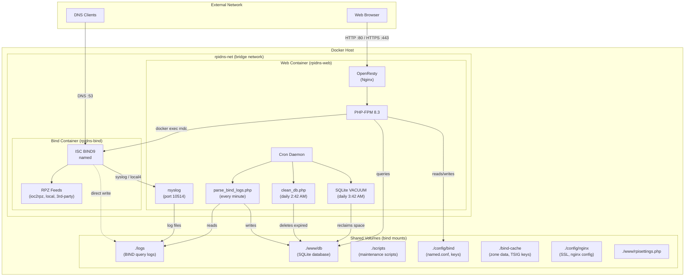

# System Architecture

## Overview

RpiDNS is a DNS-based ad/malware blocker powered by [ioc2rpz.net](https://ioc2rpz.net). It runs as a two-container Docker deployment: a **Bind** container handling DNS resolution with RPZ (Response Policy Zone) support, and a **Web** container providing the management UI, log processing, and data storage.

This document describes the overall system architecture, container model, inter-container communication, data flow, volume strategy, and the cron-based data pipeline.

## Two-Container Deployment Model

RpiDNS uses two Docker containers orchestrated via `docker-compose.yml`:

### Bind Container (`rpidns-bind`)

- **Image:** `ghcr.io/homas/rpidns-bind:latest`
- **Role:** ISC BIND9 DNS server with RPZ support
- **Exposed ports:** `53/tcp`, `53/udp` (DNS)
- **Process:** `named` running in foreground (`-f`) as the `named` user
- **Startup sequence** (via `rpidns-docker/bind/entrypoint.sh`):
  1. Generate `rndc.key` and `rndc.conf` if not present
  2. Inject rndc controls into `named.conf` if missing
  3. Initialize local zone files if absent
  4. Set ownership on `/var/cache/bind` and `/opt/rpidns/logs`
  5. Optionally configure syslog forwarding (if `RPIDNS_LOGGING=forward`)
  6. Detect IPv6 availability; start `named` in IPv4-only mode if no public IPv6
  7. Start `named` in foreground

### Web Container (`rpidns-web`)

- **Image:** `ghcr.io/homas/rpidns-web:latest`
- **Role:** OpenResty (Nginx) + PHP-FPM + rsyslog + cron
- **Exposed ports:** `80` (HTTP), `443` (HTTPS), `10514` (syslog TCP)
- **Depends on:** Bind container (waits for healthy status)
- **Startup sequence** (via `rpidns-docker/web/entrypoint.sh`):
  1. Configure Docker socket access for `www-data` (enables `rndc reload` via `docker exec`)
  2. Verify pre-built frontend assets exist at `/opt/rpidns/www/rpi_admin/dist`
  3. Generate self-signed SSL certificates, CA certificate, intermediate certificate, and fallback certificate if not present
  4. Initialize SQLite database via `init_db.php` if not already initialized (checks `PRAGMA user_version`)
  5. Configure rsyslog based on `RPIDNS_LOGGING` mode (local or forward)
  6. Start rsyslog, cron, PHP-FPM (`php-fpm83`)
  7. Start OpenResty (Nginx) in foreground

### Health Checks

| Container | Method | Command | Interval | Timeout | Retries | Start Period |
|-----------|--------|---------|----------|---------|---------|--------------|
| Bind | DNS dig | `dig @127.0.0.1 localhost +short +time=2 +tries=1` | 30s | 10s | 3 | 10s |
| Web | HTTP wget | `wget -q --spider --timeout=5 http://127.0.0.1/blocked.php` | 60s | 15s | 5 | 30s |

Both containers use `restart: unless-stopped` policy.

## Data Flow

The core data pipeline moves DNS query data from BIND through log processing into SQLite for frontend display:

```
DNS Query → BIND Resolution → Query Logging → Syslog → Log File → PHP Parser → SQLite → Frontend
```

### Step-by-Step Flow

1. **DNS Query Reception** — A client sends a DNS query to the Bind container on port 53 (TCP/UDP).

2. **BIND Resolution & RPZ Evaluation** — BIND resolves the query, evaluating it against configured RPZ feeds. If a domain matches an RPZ rule, the configured policy action is applied (NXDOMAIN, NODATA, PASSTHRU, DROP, CNAME, or GIVEN).

3. **BIND Query Logging** — BIND logs every query and RPZ hit to syslog using the `local4` facility. Log entries include timestamp, client IP, queried domain, query type, and RPZ action (if any).

4. **Syslog Forwarding** — In local mode, the Bind container writes logs directly to the shared `/opt/rpidns/logs` volume. In forward mode, rsyslog on the Bind container forwards `local4` messages over TCP to the Web container on port 10514.

5. **Syslog Reception & File Routing** — The Web container's rsyslog receives incoming syslog messages (TCP port 10514) and routes BIND logs to per-source-IP files using a dynamic filename template: `/opt/rpidns/logs/bind_<source-ip>_queries.log`. It matches messages by program name (`named` or `bind`) or syslog facility (`local4`).

6. **Log Parsing** — The cron job runs `parse_bind_logs.php` every minute. This script reads BIND log files, parses query entries, resolves client MAC addresses via the ARP table, performs vendor lookup, and inserts records into the SQLite database (`queries_raw` and `hits_raw` tables).

7. **Data Aggregation** — `parse_bind_logs.php` also aggregates raw data into summary tables at multiple time granularities: 5-minute (`queries_5m`, `hits_5m`), 1-hour (`queries_1h`, `hits_1h`), and 1-day (`queries_1d`, `hits_1d`).

8. **Frontend Display** — The Vue 3 frontend fetches data from the PHP backend API (`rpidata.php`), which selects the appropriate aggregation tier based on the requested time period. The frontend renders dashboards, query logs, RPZ hit reports, and charts using the aggregated data.

## Inter-Container Communication

### Docker Bridge Network (`rpidns-net`)

Both containers are connected via a user-defined Docker bridge network named `rpidns-net`:

```yaml
networks:
  rpidns-net:
    driver: bridge
    ipam:
      driver: default
```

This network enables:
- **Syslog forwarding:** The Bind container can forward logs to the Web container's rsyslog on port 10514 (when `RPIDNS_LOGGING=forward`)
- **DNS resolution:** The Web container can resolve DNS queries through the Bind container
- **Container name resolution:** Docker's built-in DNS allows containers to reference each other by name (`rpidns-bind`, `rpidns-web`)

### External Port Exposure

| Port | Protocol | Container | Purpose |
|------|----------|-----------|---------|
| 53 | TCP/UDP | Bind | DNS queries from network clients |
| 80 | TCP | Web | HTTP access to management UI |
| 443 | TCP | Web | HTTPS access to management UI |
| 10514 | TCP | Web | Syslog reception from Bind (or remote instances) |

### Container Dependency

The Web container declares a dependency on the Bind container with a health check condition:

```yaml
depends_on:
  bind:
    condition: service_healthy
```

This ensures the Web container only starts after BIND is healthy and responding to DNS queries.

## Volume Mount Strategy

RpiDNS uses bind mounts (not Docker named volumes) to provide host-level access to all persistent data. Both containers share several mount points for inter-container data exchange.

### Shared Volumes

| Host Path | Bind Container Mount | Web Container Mount | Purpose |
|-----------|---------------------|---------------------|---------|
| `./logs` | `/opt/rpidns/logs` | `/opt/rpidns/logs` | BIND query logs shared between containers |
| `./config/bind` | `/etc/bind` | `/etc/bind` | BIND configuration (named.conf, keys, zones) |
| `./bind-cache` | `/var/cache/bind` | `/var/cache/bind:ro` | Zone data, TSIG keys (read-only in Web) |

### Bind-Only Volumes

| Host Path | Mount Point | Purpose |
|-----------|-------------|---------|
| `./config/bind` | `/etc/bind` | BIND configuration files |
| `./bind-cache` | `/var/cache/bind` | Persistent zone data and cache |
| `./logs` | `/opt/rpidns/logs` | BIND query log output |

### Web-Only Volumes

| Host Path | Mount Point | Purpose |
|-----------|-------------|---------|
| `./config/nginx` | `/opt/rpidns/conf` | Nginx/OpenResty configuration and SSL certificates |
| `./www/rpisettings.php` | `/opt/rpidns/www/rpisettings.php` | Application settings (retention, dashboard config) |
| `./www/db` | `/opt/rpidns/www/db` | SQLite database directory |
| `./scripts` | `/opt/rpidns/scripts` | Maintenance scripts (parse_bind_logs.php, clean_db.php, etc.) |
| `./bind-cache` | `/var/cache/bind:ro` | Read-only access to TSIG keys for nsupdate |
| `./config/bind` | `/etc/bind` | Access to BIND config for BindConfigManager |
| `/var/run/docker.sock` | `/var/run/docker.sock` | Docker socket for `rndc reload` via `docker exec` |

### Key Design Decisions

- **Bind mounts over named volumes:** Enables direct host access for debugging, backup, and manual configuration
- **Read-only bind-cache in Web:** The Web container only needs to read TSIG keys for `nsupdate` operations; it never writes zone data
- **Docker socket mount:** Allows the Web container's PHP backend to trigger `rndc reload` on the Bind container via `docker exec`, enabling live BIND configuration updates from the UI
- **Shared logs directory:** Both containers write to and read from the same logs directory, enabling the Web container's log parser to process BIND's query logs

## Cron-Based Data Pipeline

The Web container runs three scheduled tasks that form the data processing and maintenance pipeline. These are defined in `rpidns-docker/web/crontab`:

### Log Parsing — Every Minute

```
* * * * *   /usr/bin/php /opt/rpidns/scripts/parse_bind_logs.php
```

`parse_bind_logs.php` runs every minute to:
- Read new entries from BIND query log files in `/opt/rpidns/logs/`
- Parse query records (timestamp, client IP, domain, query type, RPZ action)
- Resolve client MAC addresses via the ARP table
- Perform vendor lookup for identified MAC addresses
- Insert raw records into `queries_raw` and `hits_raw` SQLite tables
- Aggregate data into 5-minute, 1-hour, and 1-day summary tables

### Database Cleanup — Daily at 2:42 AM

```
42 2 * * *  sleep 25;/usr/bin/php /opt/rpidns/scripts/clean_db.php
```

`clean_db.php` runs daily (with a 25-second delay) to:
- Delete expired records from each table based on configurable retention periods defined in `www/rpisettings.php`
- Each aggregation tier has its own retention period (e.g., raw data kept for fewer days than daily summaries)

### SQLite VACUUM — Daily at 3:42 AM

```
42 3 * * *  sleep 25;/usr/bin/sqlite3 /opt/rpidns/www/db/rpidns.sqlite 'VACUUM;'
```

Runs SQLite `VACUUM` daily (with a 25-second delay) to:
- Reclaim disk space freed by `clean_db.php` deletions
- Rebuild the database file to reduce fragmentation
- Scheduled one hour after cleanup to ensure deletions are complete

### Additional Cron Jobs

| Schedule | Task | Purpose |
|----------|------|---------|
| Daily 2:00 AM | `find ... -mtime +30 -delete` | Remove SSL certificate cache files older than 30 days |
| Daily 3:00 AM | `find ... -atime +7 -delete` | Remove unused SSL cache certificates after 7 days |
| Daily 4:00 AM | `find ... -exec gzip` | Compress log files older than 1 day |
| Daily 5:00 AM | `find ... -mtime +30 -delete` | Remove compressed logs older than 30 days |

## Architecture Diagram



## Environment Variables

Both containers share a common set of environment variables configured via the `.env` file:

| Variable | Default | Used By | Purpose |
|----------|---------|---------|---------|
| `RPIDNS_HOSTNAME` | `rpidns.local` | Bind, Web | Hostname for SSL certificates and container identity |
| `RPIDNS_DNS_TYPE` | `primary` | Bind | DNS server role (primary/secondary) |
| `RPIDNS_DNS_IPNET` | `192.168.0.0/16` | Bind | Allowed client network for DNS queries (ACL) |
| `RPIDNS_LOGGING` | `local` | Bind, Web | Logging mode: `local` (receive logs) or `forward` (send to remote) |
| `RPIDNS_LOGGING_HOST` | *(empty)* | Bind, Web | Remote syslog host for forward mode |
| `PHP_FPM_VERSION` | `83` | Web | PHP-FPM version identifier |

## Related Documentation

- [Docker Deployment](./docker-deployment.md) — Container Dockerfiles, docker-compose.yml details, and deployment procedures
- [Backend API](./backend-api.md) — PHP API endpoints, authentication, and data aggregation
- [Frontend](./frontend.md) — Vue 3 component hierarchy, composables, and build system
- [Database](./database.md) — SQLite schema, aggregation tiers, retention, and migrations
- [BIND Configuration](./bind-configuration.md) — named.conf structure, RPZ feeds, and policy actions
- [Scripts](./scripts.md) — Maintenance scripts (parse_bind_logs.php, clean_db.php, init_db.php, etc.)
- [Configuration Files](./configuration-files.md) — PHP config, .env variables, nginx, and rsyslog settings
- [README](../README.md) — Project overview and getting started
